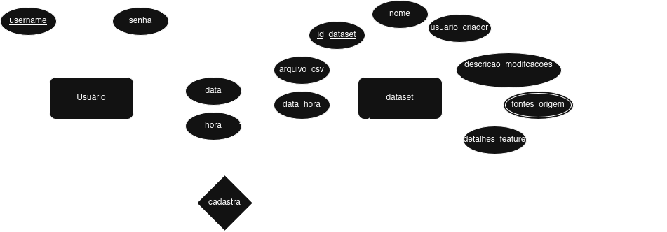
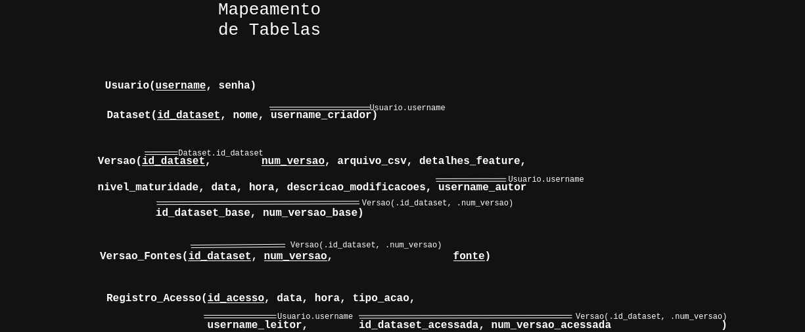

# FeatureTrack: Middleware de Feature Store

**Disciplina:** Banco de Dados - UEL (Universidade Estadual de Londrina)  
**Professor:** Daniel Kaster  
**Desenvolvedores:** Nicolas Henrique de Lima Oliveira e Caio Sweiver de Carvalho  

---

## Resumo do Projeto
O **FeatureTrack** é um sistema middleware construído sobre um SGBD relacional, projetado para atuar como uma *Feature Store* simplificada. O sistema permite o armazenamento, versionamento e rastreabilidade de datasets (arquivos CSV) voltados para tarefas de Machine Learning.

O foco principal do projeto é a implementação de boas práticas de integração de banco de dados em aplicações multicamadas, explorando consultas SQL avançadas, normalização de dados e arquitetura de rastreabilidade (linhagem).

## Tecnologias
* **Back-end:** Java/J2EE com persistência via camada DAO utilizando JDBC puro (sem frameworks ORM como JPA/Hibernate, para controle explícito do SQL).
* **Front-end:** React.js / JavaScript.
* **Banco de Dados:** PostgreSQL.

---

## Referências Visuais de Modelagem

Abaixo estão as representações gráficas da arquitetura do banco de dados desenvolvida para o escopo do projeto.

### 1. Diagrama Entidade-Relacionamento (Modelo Conceitual)
Representação das regras de negócio puras, focando nas entidades, dependências e cardinalidades antes da conversão para tabelas.

### 2. Mapeamento de Tabelas (Modelo Lógico)
Conversão do modelo conceitual para relações, destacando as Chaves Primárias (PK), Chaves Estrangeiras (FK), resolução de atributos multivalorados e reificação.

---

##  Dicionário de Dados e Justificativas Técnicas

A arquitetura foi desenhada seguindo rigorosamente a teoria do Modelo Relacional. Abaixo está a estrutura de cada tabela e as justificativas para as decisões de modelagem:

* **`Usuario`**
  Tabela fundamental para a autenticação e auditoria do sistema. Atua como o ponto de partida para a rastreabilidade, garantindo que toda ação (criação, upload ou download) seja vinculada a um autor através de chaves estrangeiras.

* **`Dataset` (Entidade Forte)**
  O repositório lógico. Foi classificado como entidade forte por possuir **independência existencial e identificadora**. Seu atributo `id_dataset` é exclusivo e suficiente para localizá-lo no banco. Armazena os metadados fixos do conjunto de dados e o usuário criador.

* **`Versao` (Entidade Fraca e Auto-relacionamento)**
  O núcleo do versionamento. Sofre de **dependência existencial**, pois não faz sentido existir uma "Versão 1.0" solta no banco sem saber a qual dataset ela pertence. Por isso, sua PK é obrigatoriamente composta: `(id_dataset, num_versao)`.
  * **A Rastreabilidade (Linked List):** Para rastrear a linhagem de qual arquivo gerou qual, utilizamos um auto-relacionamento (`id_dataset_base`, `num_versao_base`). Isso cria uma estrutura de Lista Encadeada no banco, onde cada versão só precisa apontar para seu "pai" imediato. A primeira versão de qualquer dataset recebe `NULL` nestes campos.

* **`Versao_Fontes`**
  Tabela gerada puramente por normalização estrutural para lidar com o atributo **Multivalorado** de "fontes". 
  
* **`Registro_Acesso` (A Reificação)**
  Entidade criada através do problema identificado do relacionamento N:M entre Usuário e Versão. 
  * **O Problema:** Um relacionamento N:M tradicional bloquearia (por restrição de PK) que o mesmo usuário baixasse a mesma versão em dias diferentes.
  * **A Solução:** Elevamos a ação de "acessar" a uma Entidade Forte temporal, com um `id_acesso` auto-incrementado. O Log atua como o lado "N" de dois relacionamentos 1:N (um usuário possui N logs; uma versão recebe N logs). Cada registro é um evento atômico (único) contendo carimbos de tempo (data/hora), viabilizando os cálculos estatísticos.

---

## Relatórios e Analytics (Consultas)

Para cumprir o requisito de consultas SQL avançadas, o painel administrativo consome os dados gerados pela tabela de acessos e pelo histórico de versões utilizando o motor do PostgreSQL, onde geraremos os seguintes gráficos até o momento decididos, podendo haver adições futuras:

1. **Ranking de Popularidade (Top 5 Datasets mais estourados):**
   * **Objetivo:** Identificar os conjuntos de dados com maior tração na plataforma.
  
2. **Evolução Temporal de Engajamento:**
   * **Objetivo:** Visualizar picos de uso da plataforma ao longo do tempo.

3. **Proporção de Tipos de Ação (Download vs. Visualização):**
   * **Objetivo:** Entender a taxa de conversão (quantos usuários olham os detalhes vs. quantos efetivamente baixam a feature).

4. **Tabela de Linhagem (Histórico de Versões):**
   * **Objetivo:** Exibir a árvore genealógica de um arquivo (ex: v3.0 veio da v2.0 que veio da v1.0).

---
*Este projeto é parte das entregas avaliativas do 1º e 2º bimestres da disciplina.*
